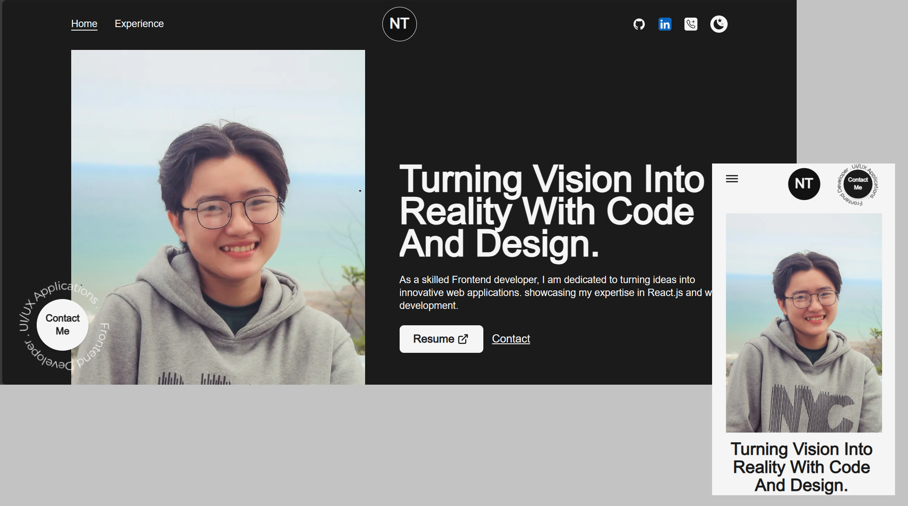

<h2 align="center">
  My Portfolio Website 
  <a href="https://charlesnguyen.vercel.app/" target="_blank">charlesnguyen.portfolio</a>
</h2>

  

 

## Built With

My personal portfolio <a href="https://charlesnguyen.vercel.app/" target="_blank">charlesnguyen.portfolio</a> which includes my resume and technical skills. 

This project was built using these technologies.

- Next.js
- Tailwind CSS
- Vercel

## Features

**📖 Multi-Page Layout**

**🎨 Styled with Tailwind CSS so that easy to customize theme**

**📦 Images have been optimized**

**📱 Fully Responsive**

## Getting Started

Clone down this repository. You will need `node.js` and `git` installed globally on your machine.

## 🛠 Installation and Setup Instructions

1. Installation: `npm install`

2. In the project directory, you can run: `npm dev`

Runs the app in the development mode.\
Open [http://localhost:3000](http://localhost:3000) to view it in the browser.
The page will reload if you make edits.

## Usage Instructions

Open the project folder and Navigate to `/src/pages/`.  
You will find all the pages used and you can edit your information accordingly.